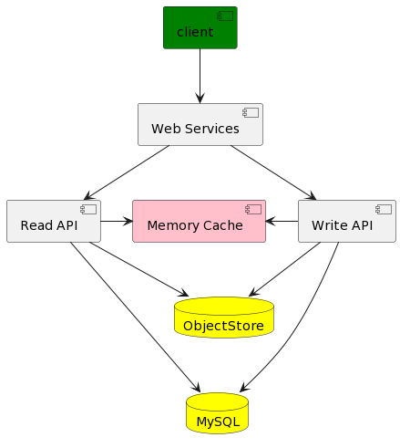

+++
author = "Tuan Trinh"
title = "System design of a blog"
date = "2022-05-16T03:19:21+07:00"
description = "System design proposal of a blog serving massive readers (10k tps)"
categories = [
    "system design"
]
tags = [
    "theory", "design", "blog"
]
image = "daniel-thomas-gWlBxOAgXgQ-unsplash.jpg"
+++
This post is part of the training program of VNG I am taking: I need to study and understand the general knowledge of system design to propose an acceptable design for this problem. Because the problem statement is quite short, I have made some assumptions when analyzing the problem as well as proposing a design to hopefully be able to solve it.

## Problem statement
Imagine you have to design a system for serving blogs to massive readers (10k tps). How would you design the system?
## Solving process
### Use cases and constraints
To keep the design simple, I only consider the criteria of "massive readers (10k tps)" so any non-related function was ignored.
#### Use cases
##### In scope
* User views the homepage of blog.
* User views a blog post.
* User searches for a keyword.
* User comments to a post anonymously.
* Service have high availability.
##### Out of scope
* User registers for an account.
* User manages their reading list.
* Admin user posts a new post. (Admin user rarely change the blog)
* Analytics.
#### Constraints and assumptions
* Viewing the homepage of blog should be fast.
* Viewing a blog post should be fast.
* Traffic is not evenly distributed.
* 10 thousands active user.
* 50 thousands blog views per day or 1.5 million blog views per month.
* 5 thousands blog comments per day or 150 thousands blog comments per month.
* 10:1 write/read ratio, system is read heavy.

### High level design

<!-- @startuml
[client] as c #green
[Web Services] as ws
[Read API] as r
[Write API] as wr
[Memory Cache] as m #pink
database MySQL as d #yellow
database ObjectStore as o #yellow

c -d-> ws
ws -d-> r
ws -d-> wr
r -r-> m
wr -l-> m
r --d-> d
wr --d-> d
wr -d-> o
r -d-> o
@enduml -->
### Design core components
#### User views a blog post
* The user posts a blog post viewing request to the Web Server.
* The Web Server fowards the request to the Read API Server.
* Read API server get data from the Memory cache. Memory cache stores IDs, some tag names and some keywords of blogs which are mostly recently viewed or changed (user commented to that blog).
* Based on data got from Memory cache, Read API get full blog data in Relational Database (e.g. MySQL) and Object Store (for media).
#### User views the homepage of blog
* This case is simmilar to the case of viewing a blog post except we can store entire homepage into object store for faster access since the blog do not change regularly.
#### User searches for a keyword
* This case is simmilar to the case of viewing a blog post.
#### User comments to a post anonymously
* The user posts a comment to a blog post they are viewing to the Web Server.
* The Web Server fowards the request to the Write API Server.
* Write API server look for data of current post in Object stores. Based on that data, Write API server stores full comment in Relational Database and Object Store (for media).
### Scale the design
Because the system needs to serve 10 thousands person simultaneously, we need to add more components to the system so that it can handle these massive readers. I choose the approach of horizontal scaling instead of vertical scaling because the blog system does not operate in a computational expensive way. It just does some simple operations but the amount of these operations is too large.
#### Use CDN
We need to use CDN to make the access to media faster and reduce the workload of the object store. CDN is connect to Object Store and Web Services return to appropriate CDN to serve the users.
#### Use Load Balancer and multiple Web Services and API Services
Load balancer distribute the work to the Web Services. Web Services choose among many Read and Write API Services the suitable one to foward them the work.
#### Use SQL Write Master Slave - SQL Read Replica
Use this model to help accessing and storing data in Database faster and more efficiently.
#### Other suggestion
The blog does not need to serve the user real-time communication, so the comment can be process asynchronously (we need to inform users about that). This approach can postpone the write operations on peak time so it can prevent the server from crashing.
